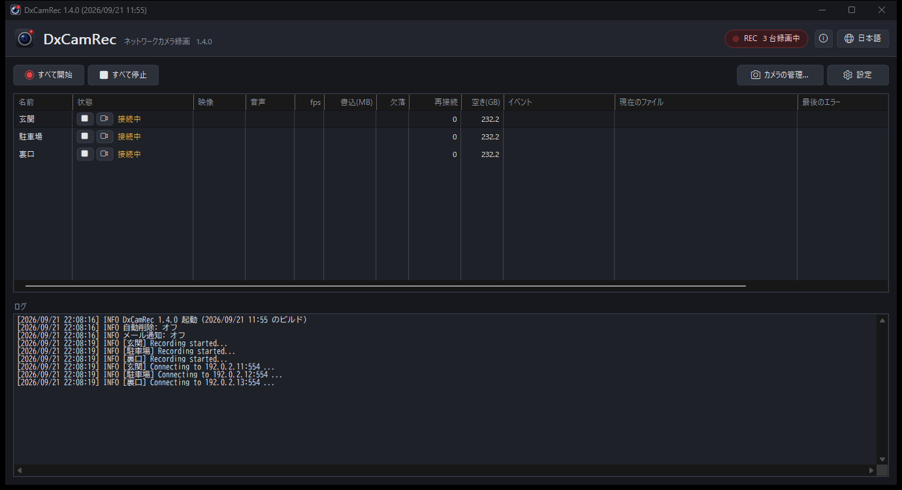

# DxCamRec

ネットワークカメラ (RTSP / ONVIF) の映像と音声を、パソコンに録画し続ける Windows 用のソフトです。
映像は再圧縮しないので、画質が落ちず、CPU負荷も軽いです。

**English: [README.md](README.md)**

## できること

- **複数のカメラを同時に録画**し、1 時間ごとなどに分けて `.ts` ファイルに保存します。
  受信した映像をそのまま保存するので、画質が落ちません。
- **H.264 / H.265** の映像と、**G.711 (PCMA/PCMU) / AAC** の音声に対応しています。
- **映像をウィンドウで見られます**。録画していないカメラも、見ている間だけ映像を受け取ります。
  首振り (PTZ) に対応したカメラは、その画面から向きを変えられます。
- **ONVIF のイベントをメールで通知**します。人物検知やラインクロスなどを検知すると、
  そのときの画像を、お使いの SMTP サーバー (Gmail など) から送ります。
- **録画の自動削除**。保存先の空き容量が減ったとき、または決めた日数を過ぎた録画を、古い方から消します。
- **カメラの検索**。同じネットワークの ONVIF カメラを探して、映像の URL を自動取得します。
- **タスクトレイに常駐**します。× ボタンは画面を隠すだけで録画は続き、録画中はアイコンの
  ランプが赤くなります。
- **日本語と英語**に対応し、Windows の表示言語に合わせて自動で切り替わります。
- FFmpeg も追加のランタイムも要りません。実行ファイル 1 つです。

## ダウンロード

最新版は **[Releases](https://github.com/HDBENCH/DxCamRec/releases)** からどうぞ。

| ファイル | 中身 |
|----------|------|
| `DxCamRec-<版>.msi` | インストーラー。Program Files にインストールされます。デスクトップのショートカットと自動起動を選べます。 |
| `DxCamRec-<版>-manual.zip` | 実行ファイルと説明書のみ。任意の書き込めるフォルダに展開して実行します。 |

## 動作環境

- 64bit 版 Windows 10 / 11
- RTSP に対応したネットワークカメラ (H.264 / H.265)
- H.265 の映像を**画面に表示する**には、Windows の「HEVC ビデオ拡張機能」が必要です。
  多くの PC にはメーカー提供版 (無料) が入っています。録画するだけなら要りません。

## 使い方

1. 「**カメラの管理...**」の「**追加...**」でカメラを登録します。「**検索...**」でネットワーク上のカメラを探せます。
2. 一覧の「**状態**」の欄の最初のボタンで録画の開始と停止、その右のボタンで映像を表示します。
   行を右クリックすると他の操作も選べます。「**すべて開始**」「**すべて停止**」で全台をまとめて操作できます。
3. 「**設定**」に、録画の自動削除・メール通知・「起動時に録画を開始」があります。
4. 右上の **×** は画面を隠すだけで、録画は続きます。タスクトレイのアイコンをクリックすると戻り、
   右クリックの「**終了**」で終了します。

設定とログは、zip 版では実行ファイルのあるフォルダ、MSI で入れた場合は `C:\ProgramData\DxCamRec\` に置かれます。
録画ファイルは、カメラごとに指定した保存先に作られます。

## 使用許諾

DxCamRec は**フリーウェア**です。個人でも法人でも、無料で使えます。
全文は [LICENSE.ja.txt](LICENSE.ja.txt) (英語は [LICENSE.txt](LICENSE.txt)) をご覧ください。

お役に立ちましたら寄付を歓迎します。寄付は任意で、あってもなくても機能は同じです。
「バージョン情報」の画面にリンクがあります。

---

(C) 2026 HDBENCH.NET
