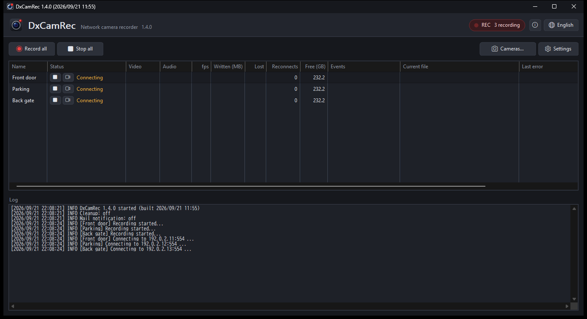

# DxCamRec

A network camera recorder for Windows. It records the video and audio of RTSP / ONVIF cameras
to your PC, around the clock, without re-encoding.

**日本語の説明は [README.ja.md](README.ja.md) にあります。**

## Features

- **Records several cameras at once** and splits the recordings into `.ts` files (hourly by default).
  The video is stored as it arrives, so the picture never loses quality and the CPU is barely used.
- **H.264 / H.265 video**, and **G.711 (PCMA/PCMU) / AAC audio**.
- **Live view** in its own window, for recording and non-recording cameras alike.
  Cameras that support PTZ can be moved from that window.
- **Mail notification for ONVIF events** (person detected, line crossing, and so on): DxCamRec
  sends the images from the moment of the event through your own SMTP server, such as Gmail.
- **Automatic cleanup**: the oldest recordings are deleted when the drive runs low on free space,
  or when they are older than a number of days.
- **Camera search**: finds ONVIF cameras on the network and fills in the stream URL for you.
- **Stays in the notification area.** The close button only hides the window; recording continues,
  and the tray icon shows a red lamp while recording.
- **English and Japanese**, chosen automatically from the Windows display language.
- No FFmpeg and no extra runtime: a single native executable that speaks RTSP itself.

## Download

Get the latest release from **[Releases](https://github.com/HDBENCH/DxCamRec/releases)**.

| File | What it is |
|------|------------|
| `DxCamRec-<version>.msi` | Installer. Installs into Program Files, with an optional desktop shortcut and autostart. |
| `DxCamRec-<version>-manual.zip` | Just the executable and the documents. Extract it anywhere you can write to, and run it. |

## Requirements

- 64-bit Windows 10 / 11
- A network camera that speaks RTSP (H.264 or H.265)
- To *display* H.265 video, Windows needs the "HEVC Video Extensions". Most PCs already have the
  version supplied by the PC maker. Recording H.265 does not need it.

## Getting started

1. Open **Cameras...** and add a camera with **Add...**. **Search...** looks for cameras on the network.
2. The first button in the **Status** column starts and stops recording; the next one opens the video.
   Right-click a row for more, and use **Record all** / **Stop all** for every camera at once.
3. **Settings** holds automatic cleanup, mail notification and "Start recording on startup".
4. The close button (x) hides the window and keeps recording. Click the tray icon to bring it back,
   or right-click it and choose **Exit** to close DxCamRec.

Settings and logs live next to the executable for the zip edition, and in
`C:\ProgramData\DxCamRec\` when installed with the MSI. Recordings go wherever you point each camera.

## License

DxCamRec is **freeware** — free for personal and business use. See [LICENSE.txt](LICENSE.txt)
(Japanese: [LICENSE.ja.txt](LICENSE.ja.txt)) for the full terms.

If DxCamRec is useful to you, a donation is welcome and entirely voluntary — the software works the
same either way. The **About** screen has the link.

---

(C) 2026 HDBENCH.NET
